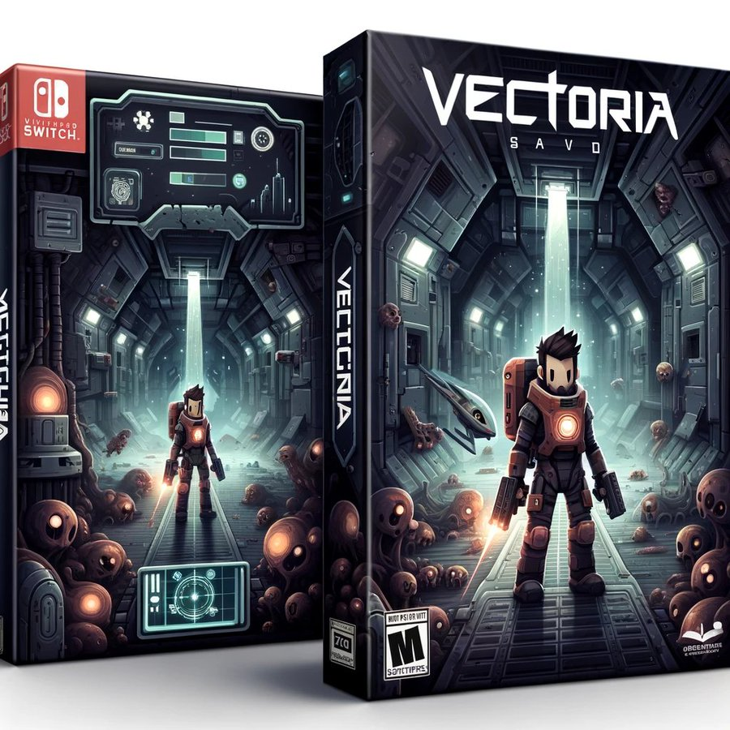

# Vectoria - Savior

After several years voyaging through the cosmos in search of a new home for humanity, the Vectoria space cruiser encounters a mysterious calamity. Strange, otherworldly bugs have infested the ship, turning many crew members hostile. Now, it's up to you to unravel the mystery behind these bizarre events and save the sane remnants of the crew – all while fighting to retain your own sanity in the face of growing chaos. Embark on a harrowing journey through the Vectoria, where every corridor holds secrets, dangers, and the faint hope of salvation for humankind."

# How to build

The game is built using [Godot](https://godotengine.org/) 4.3.dev branch with no other dependency (at the moment).
Worth noticing that I'm building Godot from source, it is most likely the required version will be updated with whatever is on the
_master_ branch of [Godot github repository](https://github.com/godotengine/godot/).

# Why are you doing this?

Fun, to start with.
I expect this to be a simple yet well polished game. While in development phase everything might change on this repository as this is the first Game I'm building as an indie game dev.

At the moment of writing this, most mechanics are implemented on its most basic form, waiting to be polished. Code is also disorganized and most likely rather inneficient.

If for whatever reason you try to build this, be alerted that there are high chances you can't play or find unexpected issues along the way.

# Is this a commercial game?

No... or yes?

I expect to be able to publish this game in some sort but the main reason for doing it is for fun and learn not only about Godot and game development but also game design, publishing, etc.

# More information

[Vectoria Savior GDD](https://docs.google.com/document/d/16tqB3NxFhP6myFY53WGTqCsE79c7gY-7HOIu54AJulU/edit?usp=sharing)

[Alidion Logs Podcast (Spanish)](https://podcasters.spotify.com/pod/show/alidion.studio)
